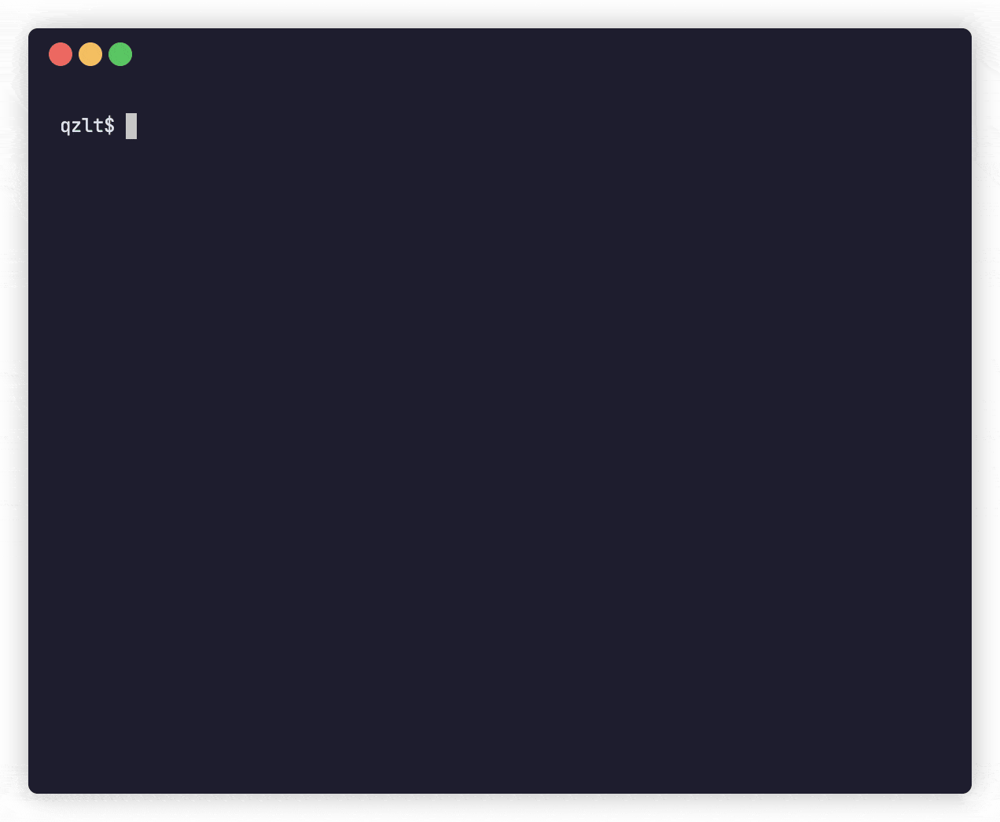

<div id="top"></div>


<br />
<div align="center">
  <h3 align="center">qzlt</h3>
  <p align="center">
    A Quizlet clone for the command line.
  </p>
</div>


## About

<div align="center">
  
</div>

As someone who use [Quizlet](https://quizlet.com) to learn and revise new
vocabulary, I wanted to build a CLI tool that could imitate some of its features whilst
prioritising quick creation and revision of study sets.

<p align="right">(<a href="#top">back to top</a>)</p>


### Built With

* [Python](https://www.python.org/)
* [Typer](https://typer.tiangolo.com/)
* [Poetry](https://python-poetry.org/)

<p align="right">(<a href="#top">back to top</a>)</p>


## Installation

#### PyPI
```
pip install qzlt
```

#### From source
With [Poetry](https://python-poetry.org) installed, run
```
git clone https://github.com/calvincheng/qzlt.git
cd qzlt
poetry shell
poetry install
```

<p align="right">(<a href="#top">back to top</a>)</p>


## Usage

### Quick start

Let's create a new set to start learning some common Chinese expressions. Run
```
> quiz sets create
Title: chinese
Description: Common expressions in Chinese
```
and follow the prompts to give your set a title and a description.

You can see that the newly created set exists by listing all sets via
```
> quiz sets list
TITLE               DESCRIPTION
chinese             Common expressions in Chinese
```

By default, new sets are empty when created. Let's change that by adding some cards. Run
```
> quiz set add chinese
```

You'll be prompted to start giving your card a term and a definition.
```
Term: 你好
Definition: Hello
Card added
```

Add as many cards as you want. When you're done, press `ctrl-C` to exit.

To see all the cards you've just added, run
```
> quiz set list chinese
      TERM          DEFINITION
[0]   你好          Hello
[1]   再見          Goodbye
[2]   開心          Happy
[3]   傷心          Sad
[4]   蘋果          Apple
[5]   香蕉          Banana
```

You're all set! To study your new set, run
```
> quiz study chinese
```

To see all the study modes available, run
```
> quiz study --help
```

<p align="right">(<a href="#top">back to top</a>)</p>


### Commands


## Roadmap

- [ ] Import from Anki
- [ ] Collect and display statistics (review heatmap, streaks, etc.)
- [ ] Add config file to customise experience (e.g. shuffle by default)
- [ ] Smarter corrections (e.g. grammatical gender: professeur•e)
- [ ] Markdown support for cards
- [ ] Incorporate TTS
- [ ] Resume interrupted sessions


<p align="right">(<a href="#top">back to top</a>)</p>


## License

Distributed under the MIT License.

<p align="right">(<a href="#top">back to top</a>)</p>


## Contact

Calvin Cheng - calvin.cc.cheng@gmail.com

Project Link: [https://github.com/calvincheng/qzlt](https://github.com/calvincheng/qzlt)

<p align="right">(<a href="#top">back to top</a>)</p>
